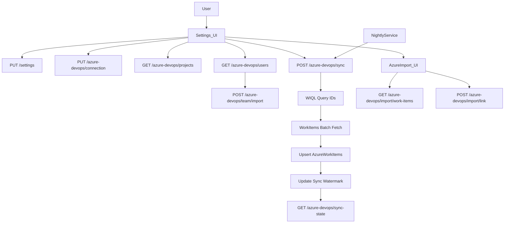

# Azure DevOps Setup + Sync Flow

```mermaid
flowchart TD
    user[User] --> settingsUi[Settings_UI]
    settingsUi --> saveSettings["PUT /settings"]
    settingsUi --> saveConnection["PUT /azure-devops/connection"]

    settingsUi --> listProjects["GET /azure-devops/projects"]
    settingsUi --> listUsers["GET /azure-devops/users"]
    listUsers --> importTeam["POST /azure-devops/team/import"]

    settingsUi --> syncNow["POST /azure-devops/sync"]
    syncNow --> wiql["WIQL Query IDs"]
    wiql --> batchFetch["WorkItems Batch Fetch"]
    batchFetch --> upsertDb["Upsert AzureWorkItems"]
    upsertDb --> updateState["Update Sync Watermark"]
    updateState --> syncState["GET /azure-devops/sync-state"]

    settingsUi --> importPage[AzureImport_UI]
    importPage --> listImport["GET /azure-devops/import/work-items"]
    importPage --> linkItems["POST /azure-devops/import/link"]

    nightly[NightlyService] --> syncNow
```
