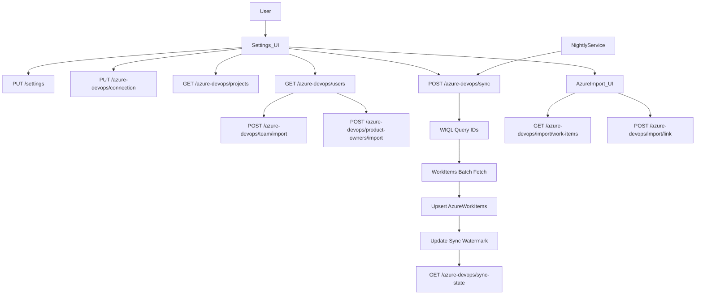

# Azure DevOps Setup + Sync Flow

## Product Owner Mapping Note

- `AzureProductOwnerMapping` is intentionally many-to-one to `ProductOwner`.
- Import dedupes Product Owners by display name (case-insensitive), so two Azure identities can resolve to one local Product Owner record.
- `AzureUniqueName` is still unique per mapping row, so one Azure identity cannot be imported twice.
