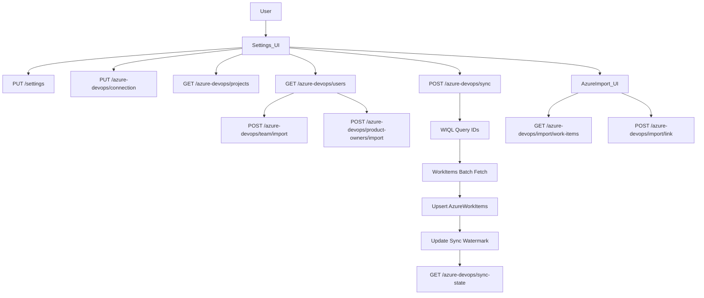

# Azure DevOps Setup + Sync Flow


```mermaid
flowchart TD
    user[User] --> settingsUi[Settings_UI]
    settingsUi --> saveSettings["PUT /settings"]
    settingsUi --> saveConnection["PUT /azure-devops/connection"]

    settingsUi --> listProjects["GET /azure-devops/projects"]
    settingsUi --> listUsers["GET /azure-devops/users"]
    listUsers --> importTeam["POST /azure-devops/team/import"]
    listUsers --> importProductOwners["POST /azure-devops/product-owners/import"]

    settingsUi --> syncNow["POST /azure-devops/sync"]
    syncNow --> wiql["WIQL Query IDs"]
    wiql --> batchFetch["WorkItems Batch Fetch"]
    batchFetch --> upsertDb["Upsert AzureWorkItems"]
    upsertDb --> updateState["Update Sync Watermark"]
    updateState --> syncState["GET /azure-devops/sync-state"]

    settingsUi --> importPage[AzureImport_UI]
    importPage --> listImport["GET /azure-devops/import/work-items"]
    importPage --> linkItems["POST /azure-devops/import/link"]
```

## PAT configuration

- Runtime reads **`AzureDevopsToken`** from configuration (user-secrets, `appsettings`, or environment / Compose env).
- If the PAT is missing, Azure client calls fail with an actionable message to set `AzureDevopsToken`.

## Area-path scoping

Sync WIQL always scopes work items to the saved connection area path:

```text
[System.AreaPath] UNDER '{AreaPath}'
```

Combined with `[System.TeamProject] = @project`, ordered by `[System.ChangedDate] ASC, [System.Id] ASC`, paged (`$top=200`).

## Incremental watermark

`AzureSyncState` stores:

| Field | Role |
|---|---|
| `LastSuccessfulChangedUtc` | Last successfully processed `System.ChangedDate` |
| `LastSuccessfulWorkItemId` | Tie-breaker when multiple items share that changed date |

When a watermark exists, WIQL adds:

```text
([System.ChangedDate] > '{date}')
  OR ([System.ChangedDate] = '{date}' AND [System.Id] > {lastWorkItemId})
```

If only the changed date is present (no work-item id), the clause is `[System.ChangedDate] >= '{date}'`. After each successful run, both watermark fields advance to the latest processed item.

## Product Owner Mapping Note

- `AzureProductOwnerMapping` is intentionally many-to-one to `ProductOwner`.
- Import dedupes Product Owners by display name (case-insensitive), so two Azure identities can resolve to one local Product Owner record.
- When a display name is reused, the API returns `reusedProductOwnerNames` so the UI can show a non-blocking warning.
- `AzureUniqueName` is still unique per mapping row, so one Azure identity cannot be imported twice.

## Team member provenance

- Team members are created **only via Azure user import** (`Azure Setup` → choose project/team, or `Settings → Azure Import`, then `POST /azure-devops/team/import`).
- There is **no** manual create/delete team-member UI in v1. After import, you can edit profile, signals, notes, risks, and growth for a member.
- Backend `POST /team-members` remains for import internals and tests; the UI does not expose it for day-to-day use.

## Scheduling note

There is **no** `NightlyService` (or other background scheduler) in the codebase today. Sync runs when the user clicks **Sync now** (or an API client posts `/azure-devops/sync`). A scheduled nightly sync is a future option, not implemented.
